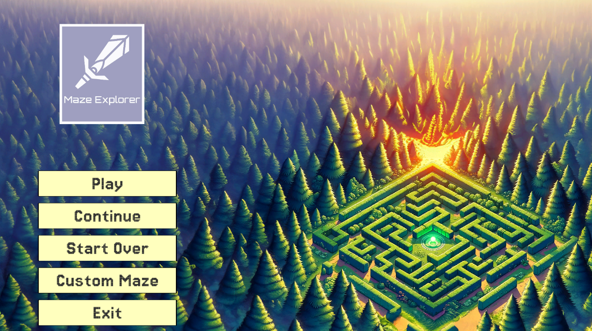

# Maze Explorer
### Overview

**Maze Explorer** is a 3D maze navigation game where players explore procedurally generated mazes to find exits. The mazes increase in complexity as the player progresses and are generated with a unique layout based on random seeds.

### Game Features

*   **Procedural Generation**: Dynamic generation of mazes with varying complexity influenced by player level and specified seeds.
*   **Player Progression**: After completing each level, players progress to larger mazes. Progress is saved, allowing continuation from the last level with the same maze configuration.
*   **Dual Exits**: Mazes feature two exits, providing strategic choices for navigation and multiple paths.
*   **Visual and Audio Enhancements**: Includes a low-poly dungeon environment, ambient sounds, and thematic music.
*   **In-game Instructions**: Provided during the first level to guide players on game mechanics and controls.

### Getting Started

#### Prerequisites

*   **Unity Version Required**: 2022.3.23f1

#### Running the Game

*   **Unity Editor**: Open the scene `Assets/0_MazeAssets/Scenes/MainMenu` and press `Play`.
*   **Executable Version**: Run `MazeGame/MazeExplorer/MazeExplorer.exe` on Windows.

### Game Controls

*   **General**: Utilizes Unity's Input System, allowing seamless input management across different devices such as keyboards, mice, and gamepads without needing script modifications.
*   **Movement**: Navigate using `W`, `A`, `S`, `D` or the gamepad's left stick.
*   **Camera Control**: Look around using the mouse or the gamepad's right stick.

### Development

#### MainMenu

The main menu features several options for game interaction:  

*   **Play**: Available for new players to start a new game.
*   **Continue**: Allows players with saved progress to continue from the last level with the same maze structure.
*   **Start Over**: Enables players with progress to restart the game from the beginning.
*   **Custom Maze**: Opens a menu for players to start a game from a specific level with a desired seed.
*   **Exit**: Quits the game.

#### Environment

Set within a dungeon environment under night conditions to enhance the maze exploration experience.

#### Game Mechanics

*   Players navigate and look around within the maze.
*   Collision detection prevents passage through walls or floors.
*   Custom trigger boxes detect player entries and exits from the maze.
*   The player camera’s Clipping Planes setting prevents the camera from clipping through walls.
*   A torch attached to the player helps illuminate the environment, enhancing navigation and visual realism.
*   Setting torch as child object to the player's camera to follow their orientation accordingly. Scaling it down to avoid clipping into walls while giving the impression of holding a torch of proportional size with the player's height.

### Code

*   **`GameManager`** : Manages overall game state, including level transitions and UI interactions.
*   **`MainMenuManager`** : Handles main menu interactions such as starting new games and loading game settings.
*   **`MazeGenerator`** : Generates complex maze structures using a recursive Depth-First Search algorithm. Manages maze layout and ensures each maze is unique based on given seeds.
*   **`MoveCamera`** : Ensures that the camera follows the player's movement smoothly and updates based on player position.
*   **`PlayerCamera`** : Controls the first-person camera that responds to mouse or gamepad input for looking around the maze.
*   **`PlayerMovement`** : Manages player movement using the Unity Input System, providing fluid control over player actions.
*   **`PlayerTrigger`** : Detects interactions with maze entrances and exits, triggering appropriate game events.
*   **`TorchBobbing`** : Simulates the bobbing motion of a torch that the player carries, enhancing the first-person experience.
*   **`TypewriterEffect`** : Implements a typewriter-like text animation for UI elements, providing engaging visual feedback.

### Performance Optimizations

The implementation of performance optimizations in "Maze Explorer" focuses on algorithm efficiency, code structure, and intelligent resource management to ensure smooth gameplay, particularly given the computational demands of generating and navigating complex 3D mazes. Here are specific examples:

*   **Recursive Depth-First Search (DFS) in `MazeGenerator`** : The use of a recursive DFS for maze generation is a deliberate choice to simplify the logic and improve code readability, which can facilitate easier debugging and maintenance. Recursive methods can be more intuitive when implementing maze generation algorithms that involve exploring and backtracking through a grid. The recursive approach also naturally implements a stack data structure (via the call stack), which is ideal for DFS traversal needs.
```
    
void DFS( int x, int y) 
{
    visited[x, y] = true;
    int[,] directions = { { 0, 2 }, { 2, 0 }, { 0, -2 }, { -2, 0 } };  
    ShuffleArray(directions);
    for (int i = 0; i < 4; i++)
    {         
        int nx = x + directions[i, 0];
        int ny = y + directions[i, 1];         
        if (IsInBounds(nx, ny) && !visited[nx, ny]) 
        {             
            visited[x + directions[i, 0] / 2, y + directions[i, 1] / 2] = true;
            DFS(nx, ny);
        }
    } 
        
}
```
    
*   **Efficient Camera Movement in `MoveCamera`** : The `MoveCamera` script is optimized to update the camera's position only in relation to the player's position without involving complex calculations or additional physics computations. This minimizes the processing overhead required per frame, crucial for maintaining frame rate stability.
    
```
    private void Update() {     transform.position = cameraPosition.position; }
```
    
*   **Input Management with Unity's Input System in `PlayerMovement` and `PlayerCamera`** : By leveraging Unity's new Input System, the game efficiently handles multiple input methods (keyboard, mouse, gamepad) without the need for complex conditional checks or separate input management systems. This approach reduces code complexity and improves the extensibility of input configurations.
    
```
private void Awake()
{     
    inputActions = new PlayerInputActions();
    InputActions.Player.Move.performed += ctx => moveInput = ctx.ReadValue<Vector2>();
    inputActions.Player.Move.canceled += ctx => moveInput = Vector2.zero; 
    
}
```
    
*   **Clipping Planes Adjustment in `PlayerCamera`** : Adjusting the near clipping plane of the camera helps prevent visual artifacts such as clipping through nearby geometry, which is particularly important in a first-person perspective game. This not only enhances the visual quality but also ensures that rendering calculations are only performed for visible objects, thus optimizing rendering performance.

These optimizations collectively contribute to the game's performance by ensuring that resource-intensive operations are managed efficiently, thereby providing a smoother and more responsive gaming experience.

### Dependencies

*   **AllSky Plugin**: Provides skybox assets for the game environment.
*   **BrokenVector**: Supplies prefabricated assets used for the dungeon environment.

### Future Improvements

*   Implementing different materials for maze walls and various exit/entrance styles.
*   Introducing diverse skyboxes to simulate different worlds and enhance the environmental variety.
*   Adding settings to adjust player's speed and look sensitivity.

### License

This project is open-sourced under the MIT License.

### Contact

For inquiries, contact Kaleb Valenzuela at [kalebvalenzuela@outlook.com](mailto:kalebvalenzuela@outlook.com).
